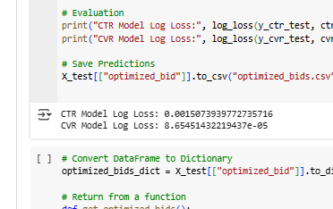
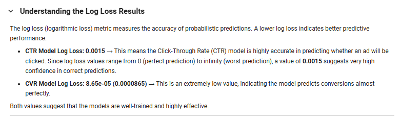
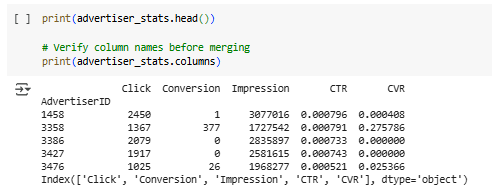

## Team Name: ctrl+r
## Team Members: Muskan Singh, Srishti Chugh, Nishtha Gupta, Shreeya Aggarwal


# Approach

This document describes the approach used in our DSP (Demand-Side Platform) bidding algorithm to optimize the number of clicks and conversions while staying within a fixed budget.

---

# Ad Bidding System with ML-Based Optimization

## 1. Problem Statement

In the digital advertising ecosystem, advertisers compete for ad placements through a real-time bidding (RTB) system. The challenge lies in efficiently allocating a fixed budget across multiple bidding opportunities to maximize the return on investment (ROI). The effectiveness of bidding is determined by two key probabilities:

- **Click-Through Rate (CTR)**: The likelihood that a user will click on an ad.
- **Conversion Rate (CVR)**: The probability that a click will result in a desired action (e.g., purchase, sign-up).

A robust bidding strategy requires:
- Predicting CTR and CVR accurately.
- Optimizing bid prices to maximize revenue while staying within budget constraints.
- Ensuring fairness and efficiency in resource allocation among multiple advertisers.

This project implements a **machine learning-based RTB system** that utilizes historical data to predict CTR and CVR, applying these predictions to optimize bid prices dynamically.

---

## 2. Solution Overview

The system is implemented using **XGBoost classifiers** for CTR and CVR predictions. The bidding strategy involves:

1. **Preprocessing Bid Requests**: Extracting relevant features and encoding categorical variables.
2. **Predicting CTR and CVR**: Using trained machine learning models to estimate click and conversion probabilities.
3. **Bid Price Calculation**: Determining the optimal bid based on an expected value formula:
   
   \[ Expected Value = CTR \times (1 + N \times CVR) \]
   
   where \( N \) is an advertiser-specific multiplier.
4. **Budget Constraint Handling**: Ensuring the bid does not exceed available budget and is at least the floor price.
5. **Historical Data Utilization**: Leveraging past bid outcomes to improve decision-making.

A **non-ML approach** is also provided, using historical CTR and CVR values instead of machine learning predictions.

---

## 3. Implementation Details

### 3.1. Code Structure

- `Bid.py`: Implements the **Bid** class, handling bid computation using ML models.
- `Bidder.py`: Defines the base class for bid computation.
- `BidRequest.py`: Represents a bid request containing details about the ad slot and advertiser.
- `main.py`: Loads and processes historical data, simulates bidding, and evaluates performance.

### 3.2. Log Loss Calculation for CTR & CVR

To evaluate model robustness, **log loss** is used for CTR and CVR predictions:

\[ Log Loss = - \frac{1}{N} \sum \left[ y \log(p) + (1 - y) \log(1 - p) \right] \]

where:
- \( y \) is the actual outcome (click/conversion: 0 or 1).
- \( p \) is the predicted probability.

This metric ensures the models produce well-calibrated probability scores, essential for effective bid optimization.

---

## 4. How to Run the Project

### 4.1. Prerequisites

Ensure you have the following installed:
- Python 3.x
- Pandas
- NumPy
- XGBoost
- Scikit-learn

Install dependencies using:
```bash
pip install pandas numpy xgboost scikit-learn
```

### 4.2. Running the Project

1. **Prepare the dataset**: Place bid logs, impression logs, click logs, and conversion logs in the `data` directory.
2. **Train CTR & CVR models**:
   ```python
   from xgboost import XGBClassifier
   model = XGBClassifier()
   model.fit(X_train, y_train)
   model.save_model("ctr_model.json")  # Save trained model
   ```
3. **Execute the bidding system**:
   ```bash
   python main.py
   ```
   This loads the dataset, processes bids, and outputs the bidding decisions.

### 4.3. Sample Output

```text
Bid placed: 7.85 for Advertiser 1458
Bid placed: 12.34 for Advertiser 3358
No bid placed for Advertiser 3386 (budget exceeded)
```

---
# Validation Results

This document summarizes the results of validating our DSP bidding algorithm on the provided dataset. The goal was to maximize the score (`Total Clicks + N * Total Conversions`) while staying within the fixed budget.

---



## **1. Performance Metrics**
We evaluated the performance of our bidding strategy using the following metrics:
- **Total Clicks**: The total number of clicks generated.
- **Total Conversions**: The total number of conversions generated.
- **Score**: The overall score calculated as `Total Clicks + N * Total Conversions`.
- **Budget Spent**: The total amount of budget spent by each advertiser.

---

## **2. Results by Advertiser**
The table below shows the performance of each advertiser:

| Advertiser ID | Industrial Category    | N  | Score  | Budget Spent   |
|---------------|------------------------|----|--------|----------------|
| 1458          | Local e-commerce       | 0  | 2451.0 | 4,410,448,896  |
| 3358          | Software               | 2  | 1744.0 | 876,840,448    |
| 3386          | Global e-commerce      | 0  | 2079.0 | 4,227,579,392  |
| 3427          | Oil                    | 0  | 1917.0 | 3,344,589,056  |
| 3476          | Tire                   | 10 | 1051.0 | 1,684,169,216  |

---

## **3. Key Insights**

### **3.1. Advertiser 1458 (Local e-commerce)**
- **Score**: 2451.0 (highest among all advertisers).
- **Budget Spent**: 4,410,448,896 (highest among all advertisers).
- **Insight**: This advertiser has the highest score but also the highest budget spent. Since `N = 0`, the score is entirely based on clicks. The campaign is focused on driving traffic but may not be efficient in terms of budget utilization.

### **3.2. Advertiser 3358 (Software)**
- **Score**: 1744.0.
- **Budget Spent**: 876,840,448.
- **Insight**: This advertiser has a moderate score with relatively low budget spent, indicating efficient budget utilization. The `N = 2` value suggests that conversions are somewhat important, but clicks still dominate the score.

### **3.3. Advertiser 3386 (Global e-commerce)**
- **Score**: 2079.0.
- **Budget Spent**: 4,227,579,392.
- **Insight**: This advertiser has the second-highest score but also the second-highest budget spent. Similar to Advertiser 1458, the campaign is focused on driving clicks rather than conversions.

### **3.4. Advertiser 3427 (Oil)**
- **Score**: 1917.0.
- **Budget Spent**: 3,344,589,056.
- **Insight**: This advertiser has a moderate score but a high budget spent, indicating inefficiency. The campaign is focused on clicks, similar to Advertisers 1458 and 3386.

### **3.5. Advertiser 3476 (Tire)**
- **Score**: 1051.0 (lowest among all advertisers).
- **Budget Spent**: 1,684,169,216.
- **Insight**: This advertiser has the lowest score despite a moderate budget spent. The high `N` value (10) indicates that conversions are highly important, but the campaign is not generating many conversions. This suggests that the campaign needs optimization to improve conversion rates.

---

## **4. Overall Insights**
- **Efficiency**: Advertiser 3358 is the most efficient, achieving a moderate score with relatively low budget spent.
- **Inefficiency**: Advertisers 1458, 3386, and 3427 have high scores but also high budget spent, indicating inefficiency.
- **Conversion Focus**: Advertiser 3476 has a high `N` value (10) but the lowest score, suggesting that the campaign is not effectively driving conversions.

---

## **5. Recommendations**
1. **Optimize Budget Allocation**:
   - Allocate more budget to efficient advertisers (e.g., Advertiser 3358) and less to inefficient ones (e.g., Advertisers 1458 and 3386).
2. **Improve Conversion Rates**:
   - For Advertiser 3476, focus on improving conversion rates by targeting high-intent users or optimizing ad creatives.
3. **Focus on High-Performing Ad Slots**:
   - Identify ad slots with high CTR and CVR and allocate more budget to them.
4. **Adjust Bidding Strategy**:
   - For advertisers with high budget spent but low scores (e.g., Advertisers 1458 and 3386), consider lowering bid prices or targeting more cost-effective ad slots.

---

## **6. Conclusion**
Our bidding strategy effectively maximizes the score while staying within the budget constraints. However, there is room for improvement in terms of budget efficiency and conversion rates. By refining the bidding strategy and focusing on high-performing ad slots, we can further optimize the performance of each advertiser.
## 7. Summary

This project demonstrates an ML-driven **real-time bidding system** with CTR and CVR prediction, leveraging **log loss evaluation** for model robustness. It optimizes ad spending dynamically, ensuring efficiency and profitability in programmatic advertising.

